# SEAPP

 

 

# User Guide

- [Introduction](#introduction)
- [Accessing](#accessing)
- [Register](#register)
- [Log In](#log-in)
- [Log Out](#log-out)
- [Functionality](#functionality)
    - [Doctor](#doctor)
        - [Navigation](#navigation)
        - [View your Data](#view-your-data)
        - [Edit your Data](#edit-your-data)
    - [Patient](#patient)
        - [Navigation](#navigation)
        - [View your Data](#view-your-data)
        - [Edit your Data](#edit-your-data)
    - [Staff](#staff)
        - [Navigation](#navigation)
        - [View your Data](#view-your-data)
        - [Edit your Data](#edit-your-data)
    - [Admin](#staff)
        - [Navigation](#navigation)
        - [View your Data](#view-your-data)
        - [Edit your Data](#edit-your-data)

## Introduction
[SEAPP](https://github.com/AmrAhmed11/Software-Engineering-Project) is A healthcare booking platform. We provide Clinic and Doctor bookings making healthcare easily accessible. 

## Accessing
To access SEAPP:

1. In a web browser, navigate to the root Uniform Resource Locator (URL) for the Pod you want to access (e.g., [`https://subdomain.domain.com`]()):
2. You will see a view of SEAPP:

    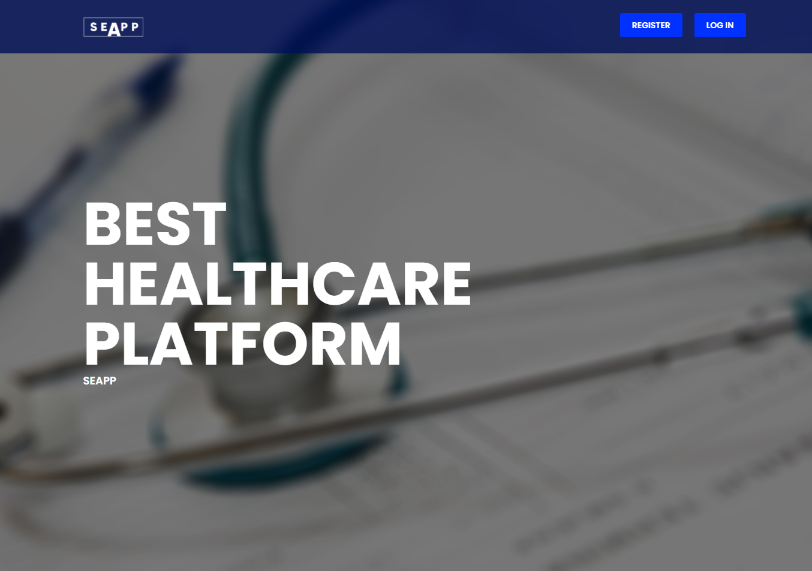

## Register 
To start using SEAPP you need to create an account first:
1. Click the **Register** button on the top right corner on the main page.
2. The **Register** page is displayed:

    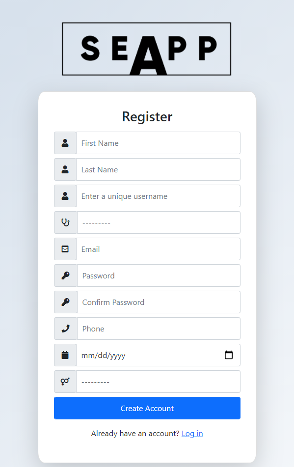

3. The **Register** dialog is presented prompting you to enter your Username and Password.

4. The **Register** dialog is presented prompting you to enter the following data: 
    1.  First Name
    2.  Last Name
    3.  Username  
    _**Note**_: shall be unique
    4.  Your Role 
        - Doctor
        - Staff
        - Patient
    5. Email
    6. Password
    7. Password again **for confirmation**
    8. Phone number
    9. Birthdate
    10. Gender
        -   Male
        -   Female    

4. After a successful Registraion, you can [view](#viewing-your-data) of all of the data to which you have permission for.         
    

## Log In
To access your data when you already have an account, and data to which you have permission to access, you must log in:
1. Click the **Log in** button on the top right corner on the main page.
2. The **Log in** page is displayed:

    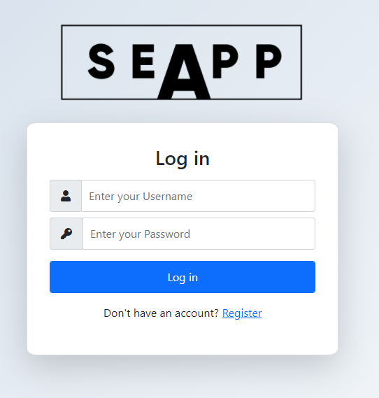

3. The **Login** dialog is presented prompting you to enter your Username and Password.

4. After a successful login, you can [view](#viewing-your-data) of all of the data to which you have permission for.

## Log Out
To log out of your SEAPP account:
1. in the navbar top-right corner click on **log Out**.

    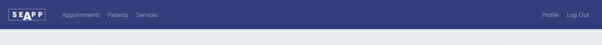

## Functionality
### Doctor    
#### Navigation
-  All functionalities could be accessed from the navigation bar in the top of the page

#### View your data
-  To view your data click on one of the following buttons from the top bar

    - **Appointments**  

    from appointment Manager you can view all your appontiment. You can also access the full details by clicking **See Details** you can view 
        - Appointment details
        - Patient details
        - Prescriptions

    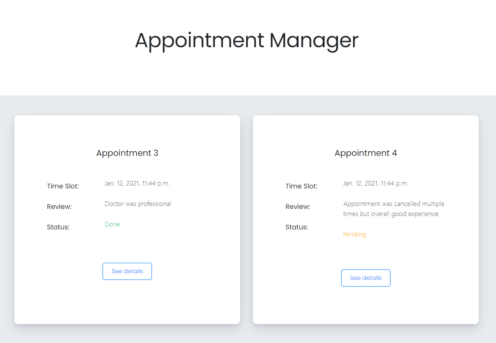

    - **Patients**

    from patients you can view all your patients with thier details

    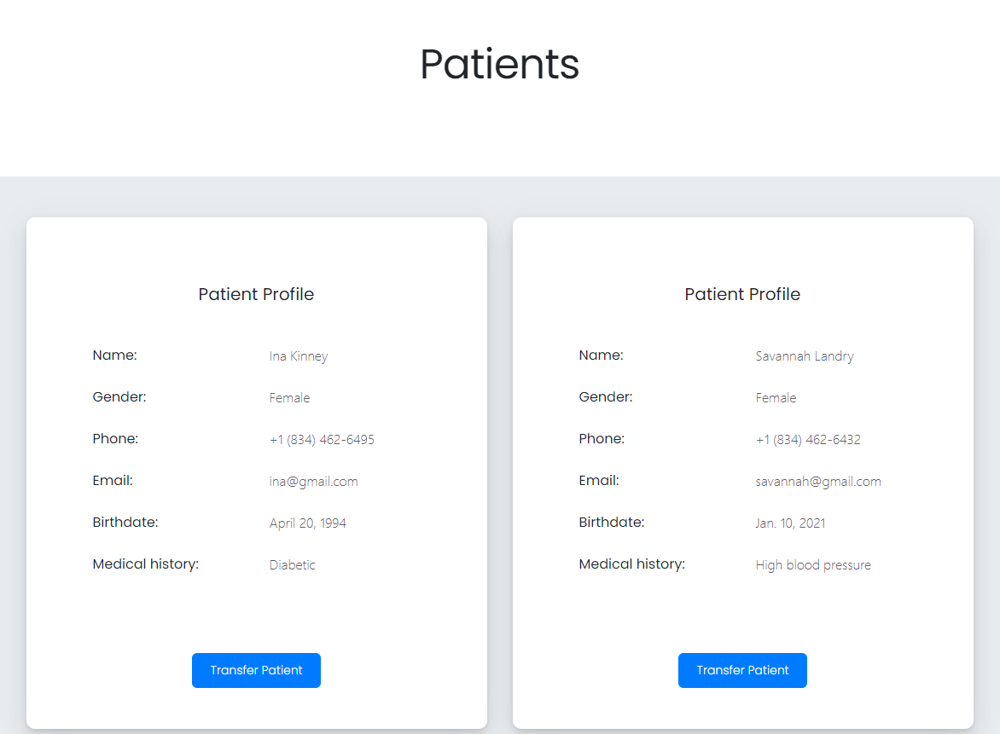

    - **Services**
    from services page you can view all your services: 
        - Clinic
        - Fees
        - Staff members and Nurses

    

    - **Information Manager**
    from Information page you can see details about your staff, patinets and appointments

    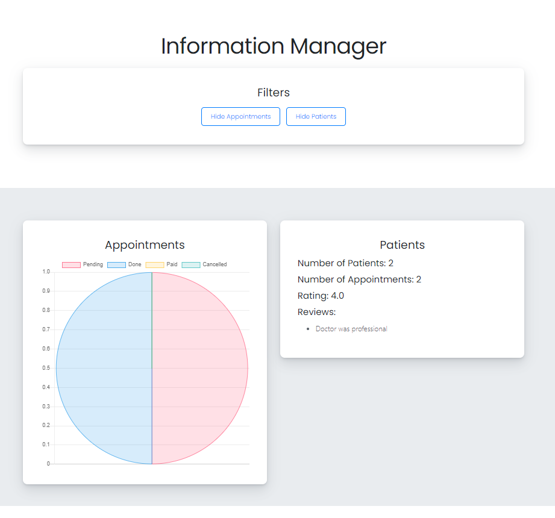

    - **Profile**
    from profile page you can view all your personal data

#### Edit your data
- From _**Appointments**_ page you can edit:

    - **Prescriptions**
        - Edit appointment prescription by adding or deleting a new medication
            - **Add** Enter The medication name in the field and then click 
            - **Delete** Click on the delete button next to the medication 

    

    - **Appoinments Dates**
        - You can shift the appointment to a new date or cancel the whole appointment
            - **Shift** click on the edit button and then select the new date
            - **Cancel** click on the cancel button then confirm the cancelation       

- From _**Services**_ page you can edit:

    - **Clinic**
        - You can create a new clinic or add a new doctor to your clinic 

    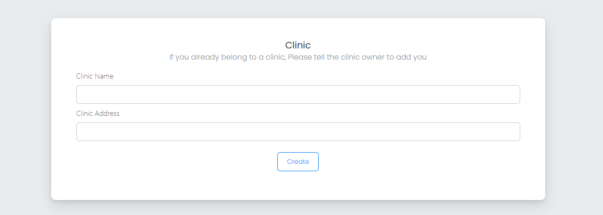

    - **Fees**
        - You can list your services fees by entering the value in the field and then click on **Change Fees** button

    - **Medical Details**    
        - Add your medical details by adding your:
            - Medical ID
            - Medical Description
            - Your Specialization
        - Then click on **Save Changes** button    

    - **Time Slots**
        - Manage your time slots, you can add new time slots by clicking on the calender button in the right of the field then choose the preferred date

    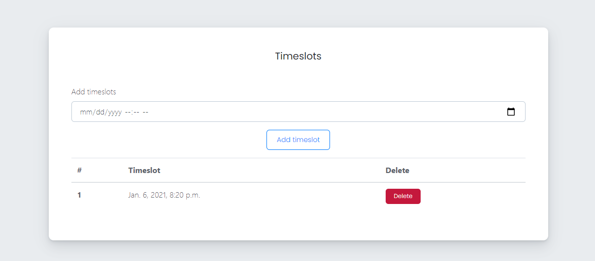    

- From _**Patients**_ page you can:

    - **Transfer Patients** 

        - You can select a patient to transfer it to another doctor by clicking on **Transfer Patient** button then selecting the doctor from the drop down menu   
        _**Note**_: by transferring the patient a new appointment will be created between the new doctor and the patient

    

    
### Patient    
#### Navigation
-  After successful login you can access Doctors and clinics

#### View your data
-  From _**Doctors**_ page you can View and filter doctors and clinics
-  To view your data click on one of the following buttons from the top bar

    - **Appointments**  

    from appointment Manager you can view all your appontiment. You can also access the full details by clicking **See Details** you can view 
        - Appointment details
        - Patient details
        - Prescriptions

    

    - **Profile**
    from profile page you can view all your personal data

    

#### Edit your data
- From _**Doctors**_ page you can create a new doctor by:
    - Selecting the preffered doctor by clicking view
    - Choose a time slot
    - Choose between personal appointment or family appointment
    - Pay the appointment fees

    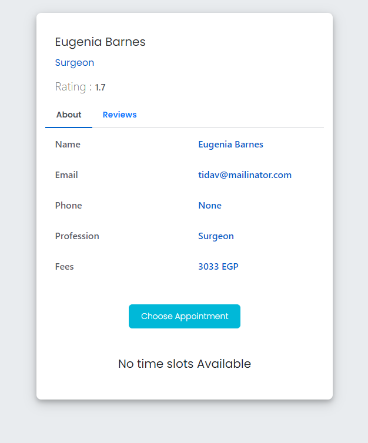

- From **Profile** page you can edit all your personal data by clicking on update profile button

    

### Staff    
#### Navigation
-  After successful login you will access specilization selection page
-  All functionalities could be accessed from the navigation bar in the top of the page

#### View your data
-  From _**Doctor Services**_ page you can access doctor services details

    - **Profile**
    from profile page you can view all your personal data

    

 #### Edit your data
- From **Profile** page you can edit all your personal data by clicking on update profile button

       

### Admin    
#### Navigation
-  After successful login you will access Information Manager
#### View your data
- **Information Manager**
    from information manager page you can view all collected date accross the app 

    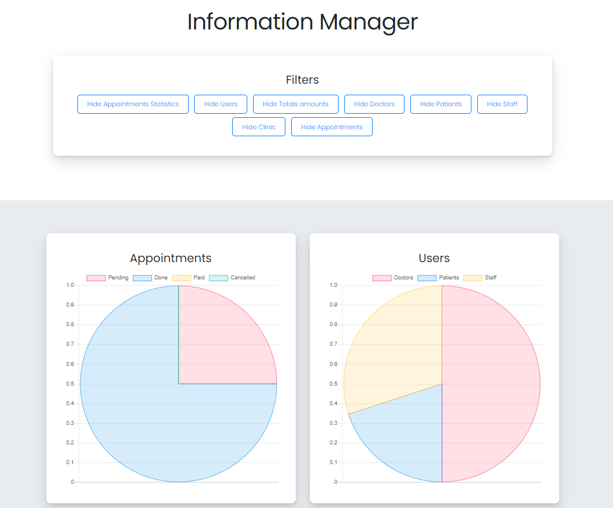

- **Profile**
    from profile page you can view all your personal data

    

 #### Edit your data
- From **Profile** page you can edit all your personal data by clicking on update profile button

        